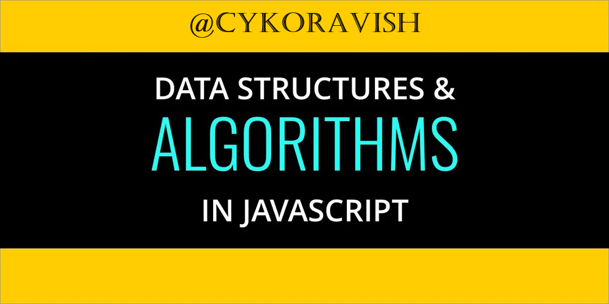

# DSA WITH JAVASCRIPT NOTES



## Data Structure

A data structure is a specific way of organizing, storing, and managing data.

## Algorithm

An algorithm is a set of well-defined instructions or a step-by-step procedure for solving a problem or performing a task.

## Big O notation

Big O notation consists of Time complexity and Space complexity.

### Time complexity

It helps us to know how long an algorithm will take to run.

### Space complexity

It helps us to know how much memory an algorithm will consume.

### What is O(n) ?

O(n) is a way to describe how long an algorithm takes to run as the size of the input (n) grows.
example: -

```javascript
function printElements(arr) {
  for (let i = 0; i < arr.length; i++) {
    console.log(arr[i]);
  }
}
```

- In this example, if the array has 5 elements, it will take 5 steps; if it has 10 elements, it will take 10 steps.

- O(n) means that if the input size doubles, the time taken will also double. It's straightforward and scales linearly with the input size.

### What is O(1) ?

O(1) describes an algorithm that takes a constant amount of time to complete, regardless of the size of the input. This means that the execution time remains the same no matter how much the input size increases.
example: -

```javascript
function getFirstElement(arr) {
  return arr[0]; // Accessing the first element
}
```

- In this example, accessing the first element of the array takes the same amount of time whether the array has 5 elements or 5 million elements.

- O(1) means that the algorithm's runtime is constant and does not change with the size of the input.

### What is O(n^2) ?

O(n^2) describes an algorithm whose time complexity grows quadratically with the size of the input (n). It's less efficient than O(n) and O(1) for large inputs because the time required increases rapidly as the input size increases.
example: -

```javascript
function printPairs(arr) {
  for (let i = 0; i < arr.length; i++) {
    for (let j = 0; j < arr.length; j++) {
      console.log(arr[i], arr[j]);
    }
  }
}
```

- In this example, if the array has 5 elements, the function will perform 5 _ 5 = 25 operations. If the array has 10 elements, it will perform 10 _ 10 = 100 operations.

### What is O(log n)?

O(log n) describes an algorithm whose time complexity grows logarithmically with the size of the input (n). This means that the time it takes to complete the algorithm increases slowly as the input size grows. Logarithmic time complexity is highly efficient, especially for large input sizes.

- Logarithmic Time: The time it takes to complete the task increases logarithmically as the input size increases.
- Example: A common example is binary search, where the input size is halved at each step.

## Understanding Output After Performing Operations on a Custom JavaScript Array Class

```javascript
class MyArray {
  constructor(length, data) {
    this.length = 0;
    this.data = {};
  }
  push(item) {
    this.data[this.length] = item;
    this.length++;
    return this.length;
  }
  get(index) {
    return this.data[index];
  }
  pop() {
    const lastElement = this.data[this.length - 1];
    delete this.data[this.length - 1];
    this.length--;
    return lastElement;
  }
  shift() {
    const firstElem = this.data[0];
    for (let i = 0; i < this.length; i++) {
      this.data[i] = this.data[i + 1];
    }
    delete this.data[this.length - 1];
    this.length--;
    return firstElem;
  }
  delete(index) {
    const item = this.data[index];

    for (let i = index; i < this.length - 1; i++) {
      this.data[i] = this.data[i + 1];
    }
    delete this.data[this.length - 1];
    this.length--;
    return item;
  }
}
const newArr = new MyArray();
newArr.push("orange");
newArr.push("mango");
newArr.push("banana");
// console.log(newArr.get(3));
// newArr.pop();
// newArr.shift();
// newArr.delete(1);
console.log(newArr);
```

### Reversing string

```javascript
const str = "hello";
const reverseStr = str.split("").reverse().join("");
console.log(reverseStr); //olleh
```

- Palindromes: If the reverse string is equal to the original one then that word is a palindrome. For example - pop, level, noon, wow

### checking if the stringis palindrome

```javascript
const checkPalindrome = (str) => str === str.split("").reverse().join("");
console.log(checkPalindrome("level")); //true if it's palindrome and else false if it's not palindrome
```
